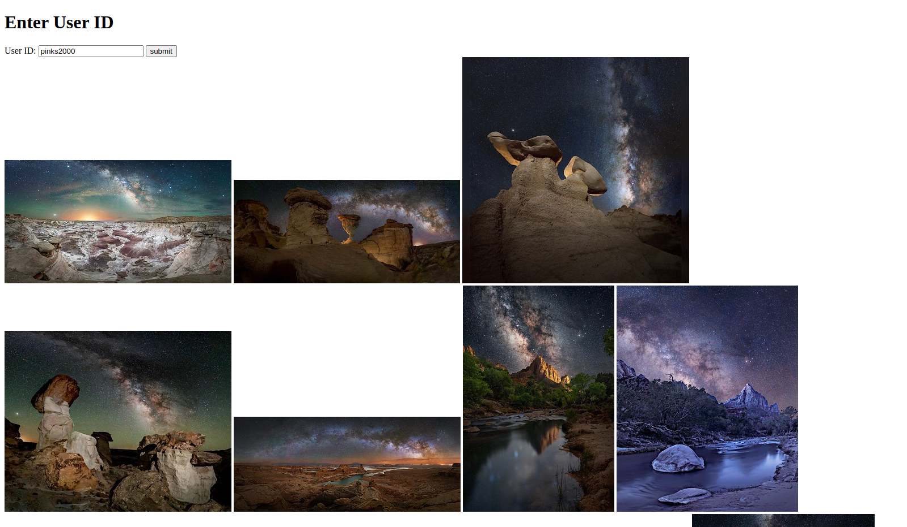

# Photo Widget API Practice
. 
Welcome to the Photo Widget API Practice! This project serves as a hands-on exercise for practicing API usage, specifically focusing on integrating the Flickr API into a Ruby on Rails application.

## Overview

This application is a simple photo widget that interacts with the Flickr API to fetch and display photos based on user input. It's designed to provide you with practical experience in working with external APIs within a Rails environment.

## Features

- Fetch photos from the Flickr API based on user input.
- Display the fetched photos in a widget format on a webpage.

## Technologies Used

- Ruby on Rails
- Figaro gem for secure storage of API keys
- flickr gem for making requests to the Flickr API

### Linux

1. First you need a Flickr API key and secret. You can get this by [Creating an app](https://www.flickr.com/services/apps/create/). 

2. Ensure you have Ruby installed by running `ruby --version`. 

        ruby --version
If not, install Ruby by following [these steps](https://www.theodinproject.com/lessons/ruby-installing-ruby) which is provided from the Odin Project

3. With Ruby installed, you can now install Rails:

        gem install rails
4. Clone this repository to your local machine.

        git clone https://github.com/PeterG-ithub/photo-widget.git
        cd photo-widget
5. Install the required Ruby gems using Bundler. If you encounter Ruby version errors here, change the version of ruby in the Gemfile

        bunle update
        bundle install
6. Create the **application.yml** following commands:

        bundle exec figaro install
7. Set up your api key in the **application.yml**

        FLICKR_API_KEY: yourAPIkeyHERE
        FLICKR_SHARED_SECRET: yourAPISecretHERE
8. Start the Rails server to run the application locally:

        rails server
9. Open browser and go to the link:
        
        http://localhost:3000/
10. Enter a user ID in the input and hit submit ex. pinks2000

## Credits
This Ruby Project is part of the curriculum provided by The Odin Project, an open-source online platform that offers free resources to learn web development.
- **Website**: [The Odin Project](https://www.theodinproject.com/)
- **Project**: [Photo widget Project](https://www.theodinproject.com/lessons/ruby-on-rails-flickr-api)

## Screenshot Demo

